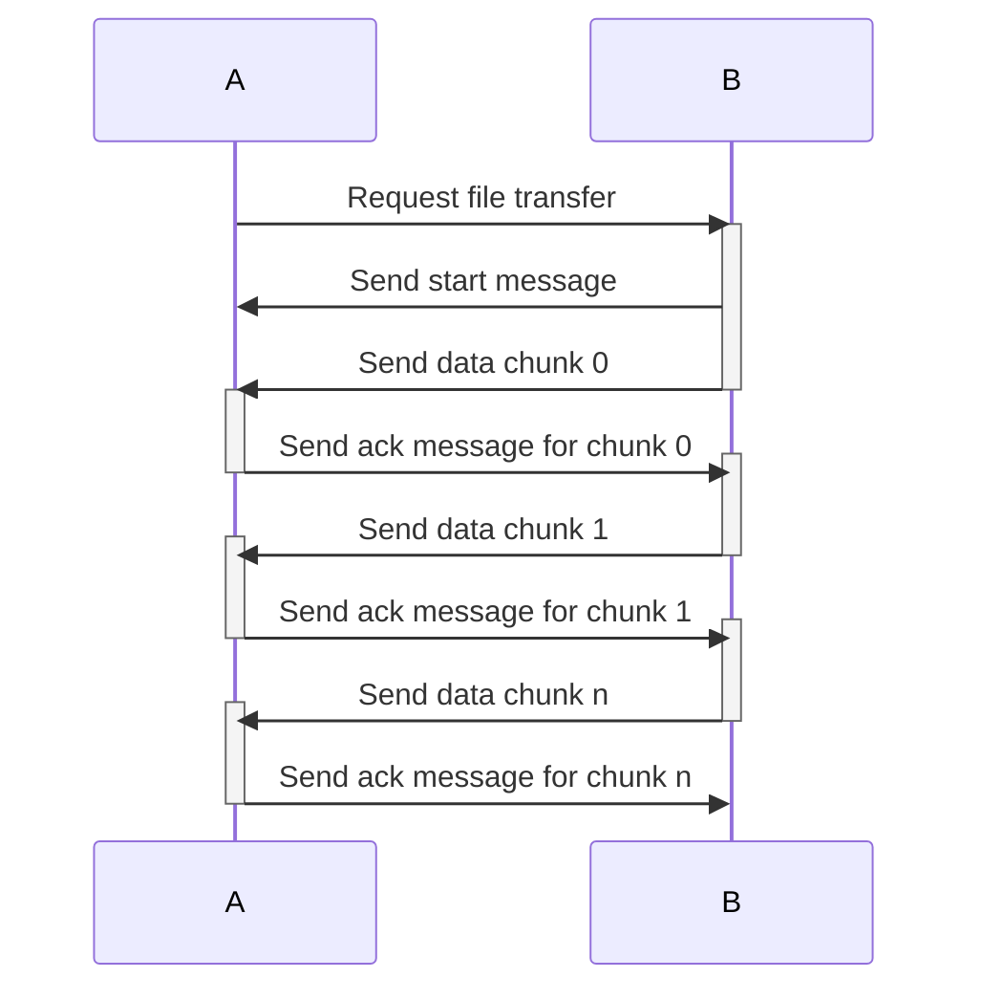

# MidiBridge

This project provides an algorithm to transfer files (or other data) between Python and JavaScript via MIDI SystemExclusive messages. It has been developed to read/write configuration files on <a href="https://circuitpython.org/" target="_blank">CircuitPython</a> or <a href="https://micropython.org/" target="_blank">MicroPython</a> devices like the PaintAudio MIDICaptain MIDI controllers (which are based on a <a href="https://www.raspberrypi.com/products/raspberry-pi-pico/" target="_blank">Raspberry Pi Pico</a> board) from the browser using the <a href="https://developer.mozilla.org/en-US/docs/Web/API/Web_MIDI_API" target="_blank">Web MIDI API</a>, without needing to mount its USB drive.

The core algorithm is ported 1:1 to genuine Python 3 and ES6 JavaScript, based on comprehensive unit tests which rely on reference data to ensure bit compatibility between the two platforms.

The algorithm is embedded in two demo applications which are also part of this project:
- A CircuitPython example running the bridge on microcontroller boards, and showing hao to embed the bridge into any other code,
- A <a href="https://pyswitch.tunetown.de" target="_blank">browser demo</a> (purely static HTML/CSS/JS) which can communicate with the python code and read/write file on the device via the browser. This can be used as basis for developing more enhanced tools based on this project, for example to visually configure MIDI Controllers running PySwitch.

## Dependencies

### Python

No dependencies, except Docker for running the unit tests.

### JavaScript

A browser supporting the <a href="https://developer.mozilla.org/en-US/docs/Web/API/Web_MIDI_API" target="_blank">Web MIDI API</a> (tested with Chrome only). 

*NOTE: For iOS, there seems to exist a "Web MIDI Browser" which emulates the API, but this is untested.*

## Protocol

This sequence diagram shows how a string of data is transmitted:



The PyMidiBridge.py and PyMidiBridge.js files contain detailed info about the exact composition for each message. All received data is checked using a CRC16 implementation. The encoding uses UTF-8 encoded strings internally.

MIDI SysEx can only transmit 7 bits per byte, so the UTF-8 bytes are packed into what is there by shifting the bytes.

### Transmission types

There are two types of transmission: File or Error. The type is set in the start message (see code comments).

- **File** type transmissions use the Storage Provider (Python) or getFile/onReceiveFinish callback (JS) to read or write the contents (see below), and are usually triggered by a request message or by directly calling sendFile or sendString on the bridge.

- **Error** type transmissions are issued if something went wrong when receiving a message, containing the message as well as its call stack. They can also be issued by calling sendString with the appropriate type.

## Implementations

### Python 3 

The PyMidiBridge class provides the basic algorithm, while the MidiBridgeWrapper class provides everything necessary to read/write files, get folder listings and handle errors.

Internally, the bridge implementation uses handlers for interfacing with the outside world. Note that the base classes shown in the following chapters do not actually exist, but just show which methods the handlers have to provide.

The provided demo shows how to use this on a CircuitPy board.

- During boot there are those options (see boot.py):
    - Hold down switch connected to GP1 of the board: Mount USB drive (in this mode, the bridge cannot write data as USB is mounted in write mode)
    - No switch held down: The drive is remounted internally in write mode so the bridge can write files. No USB drive is mounted in this mode!

- The code.py shows how your application has to pass data to the bridge wrapper. Here is a stripped down example:

```python
from usb_midi import ports
from adafruit_midi import MIDI
from pymidibridge.MidiBridgeWrapper import MidiBridgeWrapper

# Adafruit MIDI
midi = MIDI(
    midi_in = ports[0],
    midi_out = ports[1],
    out_channel = 1,
    in_buf_size = 1000
)

# Pass the MIDI instance to the wrapper, which will now handle all MIDI stuff in your application
wrapper = MidiBridgeWrapper(
    midi = midi,
    temp_file_path = '/.bridge'
)

# Here, the message loop is implemented directly. You will normally have this loop inside your script.
try:
    # Receive MIDI messages. The wrapper will pass the stuff to the MIDI bridge.
    while True:
        midi_message = wrapper.receive()
    
        # ... do something with the message in your application

except Exception as e:
    # In case of errors, we want the bridge to be functional so we can fix the errors via MIDI.
    # Here, we get the error message incl. trace, send it out via MIDI as error message, and initiate
    # a receive loop listening to bridge messages until reboot.
    import traceback
    message = traceback.format_exception(None, e, e.__traceback__)
    wrapper.error(message)
```

Errors should be catched and reported via MIDI by using the wrapper's error() method.

#### Installation

To install the demo on a device, do the following:

- Mount the device via USB (will be named "CIRCUITPY" most likely)
- Copy the code.py and boot.py files to the root folder
- Copy the folder python/lib/pymidibridge to the device as /lib/pymidibridge

#### Wrapper Protocol

The MidiBridgeWrapper uses a storage provider which first writes contents into a temporary file, which is then put where it is supposed to be when the transfer is finished.

- When called with a path that is a file, it reads/writes this file.
- When called with a path that is a folder, it delivers a table of contents for the folder (no write possible).

Folder contents are delivered as JSON strings containing an array, for example:

```json
[
    [
        "code.py",    // Name of file
        false,        // Is it a folder?
        455           // Size in bytes
    ],
    [
        "lib",
        true,
        0
    ],
    //...
]
```

#### Internal Implementation

This describes how to interface with the PyMidiBridge directly, without the MidiBridgeWrapper.

##### MIDI Send Handler

The MIDI Send Handler must be able to send MIDI messages.

Must implement this interface:

```python
class MidiSender:
    # Must send the passed data as MIDI system exclusive message. 
    # Both parameters have to be byte arrays.
    def send_system_exclusive(self, manufacturer_id, data):
        pass
```

##### Storage Provider

The storage provider must be able to read/write files, or can also be used to interface the bridge with something else than a file system like databases etc.

Must implement this interface:

```python
class StorageProvider:
    # Must return file size, or any negative number if the file does not exist
    def size(self, path):
        return -1

    # Must return an opened file handle. See below.
    def open(self, path, mode):
        return StorageFileHandle()
```

The return value of open() must return something compatible with this interface:

```python
class StorageFileHandle:
    # Must write data to the file. Data is a string.
    def write(self, data):
        pass

    # Must read the specified amount of data from the file, return "" if finished 
    # or no data is left.
    def read(self, amount_bytes):
        return ""

    # Must close the file handle
    def close(self):
        pass
```

##### Event Handler

The event handler is used for giving the user possibility to handle different kinds of events. All methods must be implemented!

Must implement this interface:

```python
class EventHandler:
    # Called when the bridge received an error message
    def handle(self, message):
        pass

    # Called when the bridge received notice about a finished transfer on the other side.
    # The transmission ID is a byte array.
    def transfer_finished(self, transmission_id_bytes):
        pass

    # Must return a trace from an Exception instance as string.
    def get_trace(self, exception):
        pass
```

#### Unit Tests

For running the tests, first run the docker container. From the project folder, run these commands in a shell:

```console
cd python/test
./docker-run
```

The docker image is now built, the container is started and you get a prompt from a bash session inside the container. There, run the tests:

```console
/project/test/run
```

The test cases and mocks are implemented in python/test/pymidibridge. As this is a crucial piece of software, test coverage is >90% for the pymidibridge.py script and the wrapper.

The python port is the one that generates the reference files in python/test/data, which ensure cross platform compatibility. To regenerate them, just delete the old ones and run the tests again. All other tests use these files to verify their processing is correct.

### JavaScript

The JsMidiBridge.js class provides the same algorithm as PyMidiBridge.py, but ported to JavaScript. The MidiBridgeHandler class is a wrapper around the bridge to integrate it in any JS application easily. The demo shows how this is done. 

When loading the demo in a browser, it tries to establish a MIDI connection to any available port (if the user grants the right to access MIDI in the first place of course), checking if there is a PyMidiBridge instance listening. If yes, the root folder will be listed, and you can:
- Navigate through the folders on the device
- Show file contents from the device
- Write file contents to the device

The demo is by no means a full IDE or something, however it features basic Python syntax checking enough for editing PySwitch config files a bit more comfortable ;) Mainly, it serves as Proof of Concept for developing a visual Config editor for PySwitch in the future.

Internally, JQuery is used, as well as a small routing lib (sammy.js), but nothing fancy to keep it simple for demonstration purposes.

#### Installation

To install the demo on any web server: 
- Copy the contents of the js/demo folder to its htdocs folder
- Copy the contents of the js/src folder (containing the library itself) into the lib/jsmidibridge folder inside htdocs.

To run locally, the docker container used for unit testing (see below) also mounts everything needed for the demo under http://localhost/demo for you.

<a href="https://pyswitch.tunetown.de" target="_blank">Link to the Live Demo</a>

#### Unit Tests

The JS test suite is built using <a href="https://github.com/jasmine/jasmine/releases" target="_blank">Jasmine 5.5.0 standalone edition</a>. There is a docker container hosting an Apache 2 server which runs the tests, with access to all reference data etc.

```console
cd js/test
docker compose up -d
```

Then open your browser and call http://localhost/test which will show you the Jasmine test runner. The test cases are implemented in js/test/htdocs/spec. As this is a crucial piece of software, test coverage is way over 95% for the JsMidiBridge.js script.

Dont forget to quit the container again using:

```console
docker compose down
```

**NOTE: The JS tests rely on the test reference data generated by the python port.**


## License

(C) Thomas Weber 2024 tom-vibrant@gmx.de

This program is free software: you can redistribute it and/or modify
it under the terms of the GNU General Public License as published by
the Free Software Foundation, either version 3 of the License, or
(at your option) any later version.

This program is distributed in the hope that it will be useful,
but WITHOUT ANY WARRANTY; without even the implied warranty of
MERCHANTABILITY or FITNESS FOR A PARTICULAR PURPOSE.  See the
GNU General Public License for more details.

You should have received a copy of the GNU General Public License
along with this program.  If not, see <https://www.gnu.org/licenses/>.

## Donate

If you use and like the application, please consider donating to support open source development: <a href="https://www.paypal.com/webapps/mpp/page-not-found?cmd=_s-xclick&hosted_button_id=6WHW7WRXSGQXY" target="_blank">Donate</a> Thanks a lot for appreciating the big efforts to create a fully tested library free of charge.


